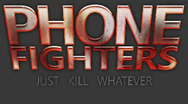
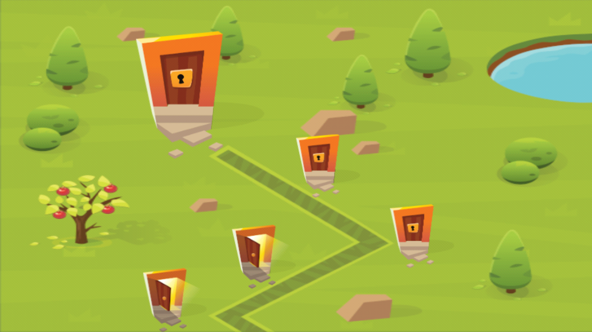
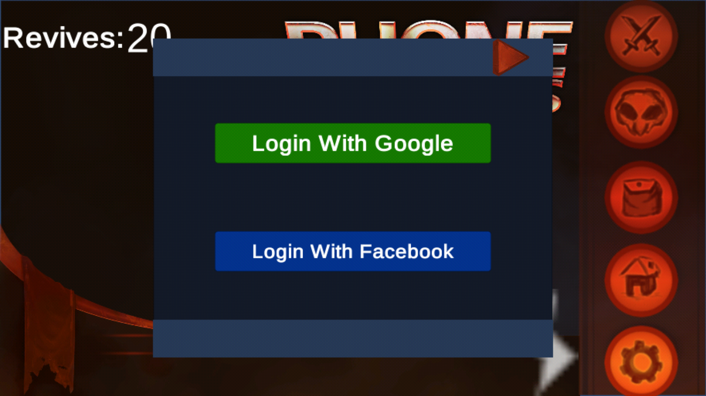

# Phone-Fighters
Little-Fighter like game with pvp mechanics

<h3>Highlights</h3>

<b>Gameplay footage</b> of first level  

Smooth transition when <b>Loading scenes</b>  

<b>Progression</b> is based on highest room complete, with rooms gradually becoming harder as you progress

<b>User creation</b> process works by automatically creating an anonymous user on initially opening the game, then later on the user can sign this account to his facebook or google accounts for security purposes.

